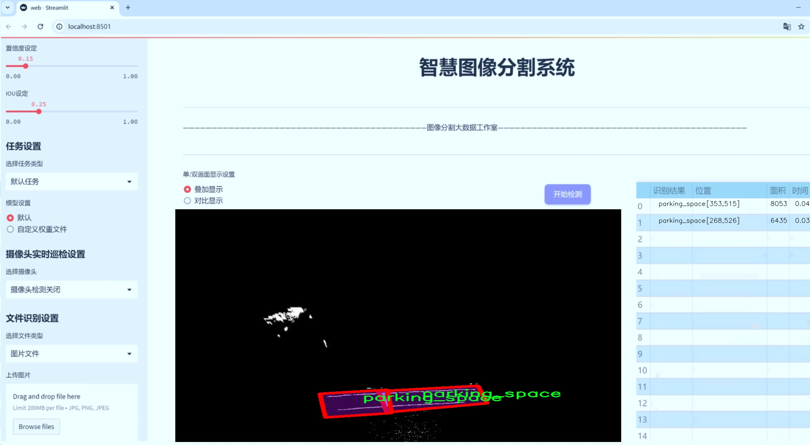
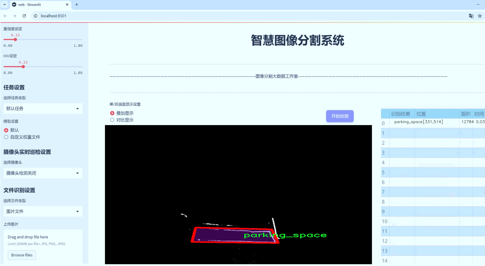
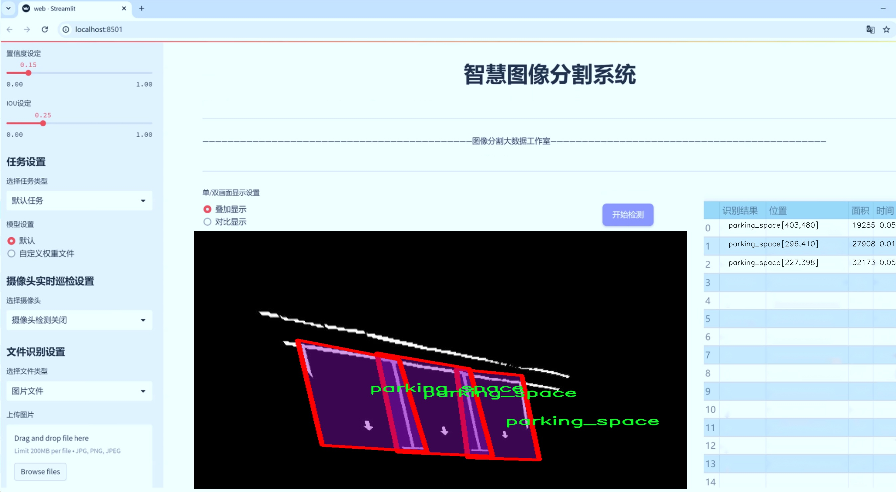
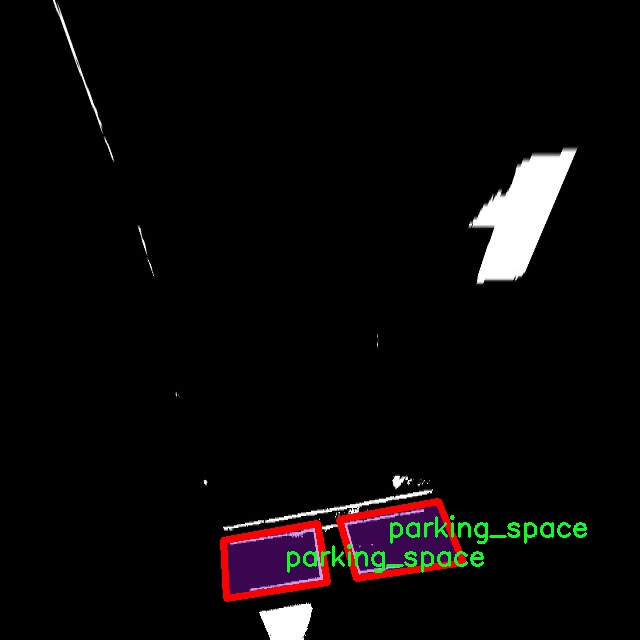
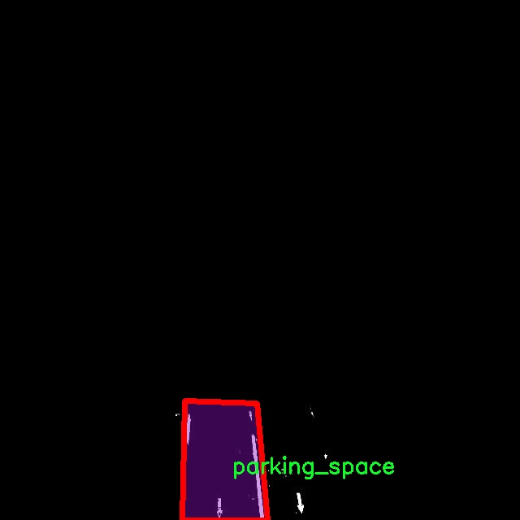
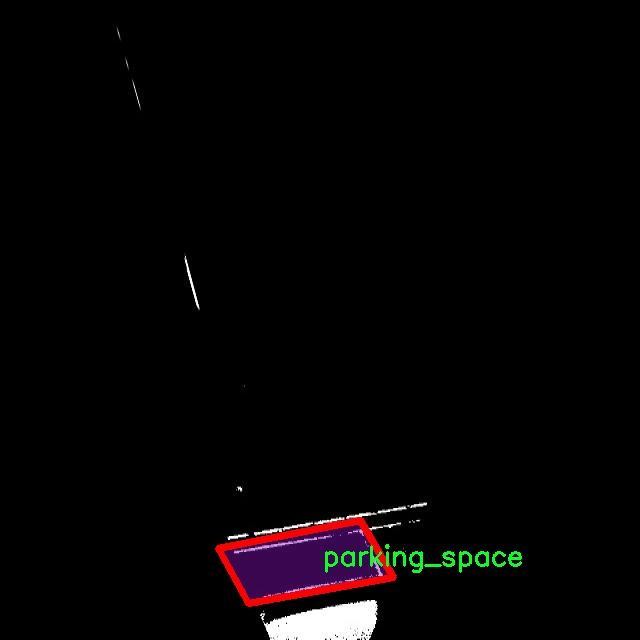
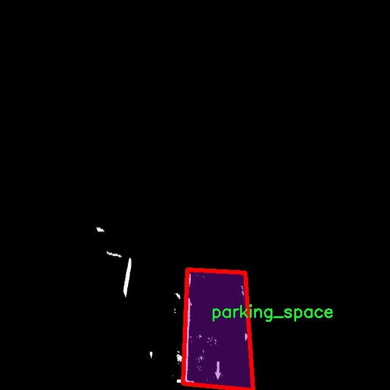
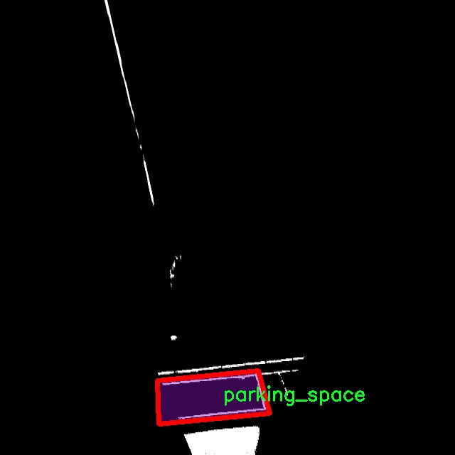

# 停车位图像分割系统： yolov8-seg-HGNetV2

### 1.研究背景与意义

[参考博客](https://gitee.com/YOLOv8_YOLOv11_Segmentation_Studio/projects)

[博客来源](https://kdocs.cn/l/cszuIiCKVNis)

研究背景与意义

随着城市化进程的加快，城市交通问题日益突出，停车难已成为困扰城市管理者和市民的普遍问题。停车位的有效管理不仅影响到城市交通的流畅性，还直接关系到资源的合理配置和环境的可持续发展。因此，如何高效、准确地识别和管理停车位，成为了智能交通系统研究的重要方向之一。近年来，深度学习技术的迅猛发展为图像处理和计算机视觉领域带来了新的机遇，尤其是在目标检测和图像分割方面，基于卷积神经网络（CNN）的算法表现出了优异的性能。

YOLO（You Only Look Once）系列模型因其实时性和高准确率，已成为目标检测领域的热门选择。YOLOv8作为该系列的最新版本，进一步提升了检测精度和速度，尤其在复杂场景下的表现更为出色。然而，针对停车位的图像分割任务，传统的YOLOv8模型仍存在一定的局限性，尤其是在细粒度的实例分割和复杂背景下的停车位识别方面。因此，基于改进YOLOv8的停车位图像分割系统的研究具有重要的理论和实际意义。

本研究所使用的数据集EZpark Detection包含1100张停车位图像，涵盖了单一类别“parking_space”。这一数据集为研究提供了丰富的样本基础，能够有效支持模型的训练和验证。通过对该数据集的深入分析，可以提取出停车位的特征信息，进而为改进YOLOv8模型提供数据支撑。针对停车位图像的特征，本文将对YOLOv8进行针对性的改进，旨在提升其在停车位实例分割任务中的表现。

研究的意义不仅体现在理论层面，更在于其实际应用价值。通过构建基于改进YOLOv8的停车位图像分割系统，可以实现对停车位的自动检测和分割，为智能停车管理系统提供技术支持。这一系统的实现将有助于提高停车位的利用率，减少寻找停车位所需的时间，从而缓解城市交通压力。此外，系统的推广应用还将为城市管理者提供数据支持，帮助其进行停车资源的合理规划和管理。

综上所述，基于改进YOLOv8的停车位图像分割系统的研究，既是对现有技术的创新与突破，也是对城市交通管理的积极响应。通过对停车位图像的精准识别与分割，不仅能够提升停车管理的智能化水平，还将为构建更加高效、便捷的城市交通体系贡献力量。未来，随着数据集的不断丰富和模型的持续优化，该系统有望在更广泛的场景中得到应用，推动智能交通领域的进一步发展。

### 2.图片演示







注意：本项目提供完整的训练源码数据集和训练教程,由于此博客编辑较早,暂不提供权重文件（best.pt）,需要按照6.训练教程进行训练后实现上图效果。

### 3.视频演示

[3.1 视频演示](https://www.bilibili.com/video/BV1afzGYbEGZ/)

### 4.数据集信息

##### 4.1 数据集类别数＆类别名

nc: 1
names: ['parking_space']


##### 4.2 数据集信息简介

数据集信息展示

在现代城市的快速发展中，停车位的管理与利用成为了交通管理的重要组成部分。为了提升停车位的检测与分割效率，特别是在智能交通系统的背景下，"EZpark Detection" 数据集应运而生。该数据集专门用于训练和改进YOLOv8-seg模型，以实现高效的停车位图像分割。数据集的设计目标是为研究人员和开发者提供一个高质量的基础，以便在复杂的城市环境中进行停车位的自动识别和分割。

"EZpark Detection" 数据集包含了丰富的停车位图像，所有图像均经过精心标注，确保其在实际应用中的有效性和准确性。该数据集的类别数量为1，专注于“parking_space”这一单一类别，旨在提供针对停车位的专门化训练数据。这种专注性使得模型能够更好地学习停车位的特征，从而在不同的环境和条件下实现更高的检测精度。

在数据集的构建过程中，研究团队考虑了多种场景和光照条件，包括白天和夜晚、晴天和阴天等，以确保模型在各种实际应用场景中的鲁棒性。图像的来源涵盖了城市街道、商业区、住宅区等多种环境，确保数据集的多样性和代表性。此外，数据集中还包含了不同类型的停车位，如平行停车位、垂直停车位和斜角停车位等，以便模型能够适应不同的停车方式。

为了提高数据集的实用性，"EZpark Detection" 数据集还包含了多种分辨率的图像，允许研究人员根据不同的计算资源和需求进行选择。这种灵活性使得数据集不仅适用于高性能计算环境，也适合在资源有限的设备上进行训练和测试。每张图像都附带了详细的标注信息，包括停车位的边界框和分割掩码，便于模型在训练过程中进行准确的学习。

在训练YOLOv8-seg模型时，"EZpark Detection" 数据集提供了一个良好的起点。YOLOv8-seg作为一种先进的目标检测与分割模型，能够在实时性和准确性之间取得良好的平衡。通过利用该数据集，研究人员可以有效地提升模型在停车位检测与分割任务中的表现，进而推动智能停车解决方案的发展。

总之，"EZpark Detection" 数据集不仅为停车位图像分割系统的研究提供了坚实的基础，也为未来的智能交通系统的构建提供了宝贵的数据支持。随着数据集的不断完善和模型的持续优化，期待在停车管理领域能够实现更高效、更智能的解决方案，为城市交通的可持续发展贡献力量。











### 5.项目依赖环境部署教程（零基础手把手教学）

[5.1 环境部署教程链接（零基础手把手教学）](https://www.bilibili.com/video/BV1jG4Ve4E9t/?vd_source=bc9aec86d164b67a7004b996143742dc)


[5.2 安装Python虚拟环境创建和依赖库安装视频教程链接（零基础手把手教学）](https://www.bilibili.com/video/BV1nA4VeYEze/?vd_source=bc9aec86d164b67a7004b996143742dc)

### 6.手把手YOLOV8-seg训练视频教程（零基础手把手教学）

[6.1 手把手YOLOV8-seg训练视频教程（零基础小白有手就能学会）](https://www.bilibili.com/video/BV1cA4VeYETe/?vd_source=bc9aec86d164b67a7004b996143742dc)


按照上面的训练视频教程链接加载项目提供的数据集，运行train.py即可开始训练



     Epoch   gpu_mem       box       obj       cls    labels  img_size
     1/200     0G   0.01576   0.01955  0.007536        22      1280: 100%|██████████| 849/849 [14:42<00:00,  1.04s/it]
               Class     Images     Labels          P          R     mAP@.5 mAP@.5:.95: 100%|██████████| 213/213 [01:14<00:00,  2.87it/s]
                 all       3395      17314      0.994      0.957      0.0957      0.0843

     Epoch   gpu_mem       box       obj       cls    labels  img_size
     2/200     0G   0.01578   0.01923  0.007006        22      1280: 100%|██████████| 849/849 [14:44<00:00,  1.04s/it]
               Class     Images     Labels          P          R     mAP@.5 mAP@.5:.95: 100%|██████████| 213/213 [01:12<00:00,  2.95it/s]
                 all       3395      17314      0.996      0.956      0.0957      0.0845

     Epoch   gpu_mem       box       obj       cls    labels  img_size
     3/200     0G   0.01561    0.0191  0.006895        27      1280: 100%|██████████| 849/849 [10:56<00:00,  1.29it/s]
               Class     Images     Labels          P          R     mAP@.5 mAP@.5:.95: 100%|███████   | 187/213 [00:52<00:00,  4.04it/s]
                 all       3395      17314      0.996      0.957      0.0957      0.0845


### 7.50+种全套YOLOV8-seg创新点加载调参实验视频教程（一键加载写好的改进模型的配置文件）

[7.1 50+种全套YOLOV8-seg创新点加载调参实验视频教程（一键加载写好的改进模型的配置文件）](https://www.bilibili.com/video/BV1Hw4VePEXv/?vd_source=bc9aec86d164b67a7004b996143742dc)

### YOLOV8-seg算法简介

原始YOLOV8-seg算法原理

YOLOv8-seg作为YOLO系列的最新进展，继承并扩展了YOLO系列在目标检测领域的优势，特别是在图像分割任务中展现出其独特的能力。YOLOv8-seg的设计理念是将目标检测与分割任务相结合，旨在实现对图像中目标的精确定位和轮廓识别。其核心原理在于通过深度学习网络的特征提取、特征融合和解码过程，实现对目标的高效分割。

首先，YOLOv8-seg的网络结构主要由输入端、主干网络、Neck端和输出端四个模块组成。输入端负责对输入图像进行预处理，包括Mosaic数据增强、自适应图片缩放和灰度填充等。这些预处理步骤不仅提高了模型的鲁棒性，还增强了对不同场景和条件下目标的检测能力。接下来，主干网络采用了CSPDarknet结构，利用卷积、池化等操作提取图像特征。与之前的YOLO版本相比，YOLOv8-seg在主干网络中引入了C2f模块，进一步提升了特征提取的效率和准确性。

在特征提取过程中，YOLOv8-seg通过引入BiFormer双层路由注意力机制构建C2fBF模块，旨在捕获远程依赖关系。这一设计使得网络能够在特征提取过程中保留更细粒度的上下文信息，从而有效减轻主干网络下采样过程中的噪声影响。尤其是在复杂的水面环境中，目标的特征往往受到背景的干扰，细粒度的上下文信息能够帮助模型更好地理解目标与背景之间的关系，降低定位误差。

Neck端则采用了基于PAN（Path Aggregation Network）结构的设计，通过上采样、下采样和特征拼接对不同尺度的特征图进行融合。这一过程不仅增强了特征的多样性，还提高了模型对小目标的感知能力。为了进一步解决小目标漏检的问题，YOLOv8-seg在Neck端引入了GSConv和Slim-neck技术，这些技术的结合使得模型在保持高精度的同时，显著降低了计算量，提升了实时检测的能力。

在输出端，YOLOv8-seg采用了解耦头结构，将分类和回归过程解耦，分别处理目标的类别和位置。这一设计的优势在于，各个任务可以更加专注于自身的目标，从而提高了模型在复杂场景下的定位精度和分类准确性。此外，YOLOv8-seg使用了Task-Aligned Assigner方法，对分类分数和回归分数进行加权匹配，进一步优化了正负样本的匹配过程。

值得一提的是，YOLOv8-seg在损失函数的设计上也进行了创新，采用了MPDIoU损失函数替代传统的CIoU损失函数。这一改进不仅提高了模型的泛化能力，还增强了对复杂场景下目标的检测精度。MPDIoU损失函数通过考虑目标的中心点、宽高比以及重叠区域，能够更全面地评估预测框与真实框之间的匹配程度，从而提升模型的学习效果。

总的来说，YOLOv8-seg算法通过结合先进的特征提取技术、特征融合策略和损失函数设计，形成了一种高效的目标检测与分割框架。其在处理复杂背景和小目标时展现出的优越性能，使其在实际应用中具有广泛的前景。随着YOLOv8-seg的不断优化和迭代，未来在目标检测和图像分割领域的应用将更加广泛，为相关研究和实践提供更为强大的技术支持。


### 9.系统功能展示（检测对象为举例，实际内容以本项目数据集为准）

图9.1.系统支持检测结果表格显示

  图9.2.系统支持置信度和IOU阈值手动调节

  图9.3.系统支持自定义加载权重文件best.pt(需要你通过步骤5中训练获得)

  图9.4.系统支持摄像头实时识别

  图9.5.系统支持图片识别

  图9.6.系统支持视频识别

  图9.7.系统支持识别结果文件自动保存

  图9.8.系统支持Excel导出检测结果数据


### 10.50+种全套YOLOV8-seg创新点原理讲解（非科班也可以轻松写刊发刊，V11版本正在科研待更新）

#### 10.1 由于篇幅限制，每个创新点的具体原理讲解就不一一展开，具体见下列网址中的创新点对应子项目的技术原理博客网址【Blog】：


[10.1 50+种全套YOLOV8-seg创新点原理讲解链接](https://gitee.com/qunmasj/good)

#### 10.2 部分改进模块原理讲解(完整的改进原理见上图和技术博客链接)【如果此小节的图加载失败可以通过CSDN或者Github搜索该博客的标题访问原始博客，原始博客图片显示正常】
### YOLOv8简介
#### Backbone


借鉴了其他算法的这些设计思想

借鉴了VGG的思想，使用了较多的3×3卷积，在每一次池化操作后，将通道数翻倍；

借鉴了network in network的思想，使用全局平均池化（global average pooling）做预测，并把1×1的卷积核置于3×3的卷积核之间，用来压缩特征；（我没找到这一步体现在哪里）

使用了批归一化层稳定模型训练，加速收敛，并且起到正则化作用。

    以上三点为Darknet19借鉴其他模型的点。Darknet53当然是在继承了Darknet19的这些优点的基础上再新增了下面这些优点的。因此列在了这里

借鉴了ResNet的思想，在网络中大量使用了残差连接，因此网络结构可以设计的很深，并且缓解了训练中梯度消失的问题，使得模型更容易收敛。

使用步长为2的卷积层代替池化层实现降采样。（这一点在经典的Darknet-53上是很明显的，output的长和宽从256降到128，再降低到64，一路降低到8，应该是通过步长为2的卷积层实现的；在YOLOv8的卷积层中也有体现，比如图中我标出的这些位置）

#### 特征融合

模型架构图如下

  Darknet-53的特点可以这样概括：（Conv卷积模块+Residual Block残差块）串行叠加4次

  Conv卷积层+Residual Block残差网络就被称为一个stage


上面红色指出的那个，原始的Darknet-53里面有一层 卷积，在YOLOv8里面，把一层卷积移除了

为什么移除呢？

        原始Darknet-53模型中间加的这个卷积层做了什么？滤波器（卷积核）的个数从 上一个卷积层的512个，先增加到1024个卷积核，然后下一层卷积的卷积核的个数又降低到512个

        移除掉这一层以后，少了1024个卷积核，就可以少做1024次卷积运算，同时也少了1024个3×3的卷积核的参数，也就是少了9×1024个参数需要拟合。这样可以大大减少了模型的参数，（相当于做了轻量化吧）

        移除掉这个卷积层，可能是因为作者发现移除掉这个卷积层以后，模型的score有所提升，所以才移除掉的。为什么移除掉以后，分数有所提高呢？可能是因为多了这些参数就容易，参数过多导致模型在训练集删过拟合，但是在测试集上表现很差，最终模型的分数比较低。你移除掉这个卷积层以后，参数减少了，过拟合现象不那么严重了，泛化能力增强了。当然这个是，拿着你做实验的结论，反过来再找补，再去强行解释这种现象的合理性。

过拟合


通过MMdetection官方绘制册这个图我们可以看到，进来的这张图片经过一个“Feature Pyramid Network(简称FPN)”，然后最后的P3、P4、P5传递给下一层的Neck和Head去做识别任务。 PAN（Path Aggregation Network）


“FPN是自顶向下，将高层的强语义特征传递下来。PAN就是在FPN的后面添加一个自底向上的金字塔，对FPN补充，将低层的强定位特征传递上去，

FPN是自顶（小尺寸，卷积次数多得到的结果，语义信息丰富）向下（大尺寸，卷积次数少得到的结果），将高层的强语义特征传递下来，对整个金字塔进行增强，不过只增强了语义信息，对定位信息没有传递。PAN就是针对这一点，在FPN的后面添加一个自底（卷积次数少，大尺寸）向上（卷积次数多，小尺寸，语义信息丰富）的金字塔，对FPN补充，将低层的强定位特征传递上去，又被称之为“双塔战术”。

FPN层自顶向下传达强语义特征，而特征金字塔则自底向上传达强定位特征，两两联手，从不同的主干层对不同的检测层进行参数聚合,这样的操作确实很皮。
#### 自底向上增强

而 PAN（Path Aggregation Network）是对 FPN 的一种改进，它的设计理念是在 FPN 后面添加一个自底向上的金字塔。PAN 引入了路径聚合的方式，通过将浅层特征图（低分辨率但语义信息较弱）和深层特征图（高分辨率但语义信息丰富）进行聚合，并沿着特定的路径传递特征信息，将低层的强定位特征传递上去。这样的操作能够进一步增强多尺度特征的表达能力，使得 PAN 在目标检测任务中表现更加优秀。


### 可重参化EfficientRepBiPAN优化Neck
#### Repvgg-style
Repvgg-style的卷积层包含
卷积+ReLU结构，该结构能够有效地利用硬件资源。

在训练时，Repvgg-style的卷积层包含
卷积、
卷积、identity。（下图左图）


在推理时，通过重参数化（re-parameterization），上述的多分支结构可以转换为单分支的
卷积。（下图右图）


基于上述思想，作者设计了对GPU硬件友好的EfficientRep Backbone和Rep-PAN Neck，将它们用于YOLOv6中。

EfficientRep Backbone的结构图：


Rep-PAN Neck结构图：


#### Multi-path
只使用repvgg-style不能达到很好的精度-速度平衡，对于大模型，作者探索了多路径的网络结构。

参考该博客提出了Bep unit，其结构如下图所示：


CSP（Cross Stage Partial）-style计算量小，且有丰富的梯度融合信息，广泛应用于YOLO系列中，比如YOLOv5、PPYOLOE。

作者将Bep unit与CSP-style结合，设计了一种新的网络结构BepC3，如下图所示：


基于BepC3模块，作者设计了新的CSPBep Backbone和CSPRepPAN Neck，以达到很好的精度-速度平衡。

其他YOLO系列在使用CSP-stype结构时，partial ratio设置为1/2。为了达到更好的性能，在YOLOv6m中partial ratio的值为2/3，在YOLOv6l中partial ratio的值为1/2。

对于YOLOv6m，单纯使用Rep-style结构和使用BepC3结构的对比如下图所示：

#### BIFPN
BiFPN 全称 Bidirectional Feature Pyramid Network 加权双向（自顶向下 + 自低向上）特征金字塔网络。

相比较于PANet，BiFPN在设计上的改变：

总结下图：
图d 蓝色部分为自顶向下的通路，传递的是高层特征的语义信息；红色部分是自底向上的通路，传递的是低层特征的位置信息；紫色部分是上述第二点提到的同一层在输入节点和输入节点间新加的一条边。


我们删除那些只有一条输入边的节点。这么做的思路很简单：如果一个节点只有一条输入边而没有特征融合，那么它对旨在融合不同特征的特征网络的贡献就会很小。删除它对我们的网络影响不大，同时简化了双向网络；如上图d 的 P7右边第一个节点

如果原始输入节点和输出节点处于同一层，我们会在原始输入节点和输出节点之间添加一条额外的边。思路：以在不增加太多成本的情况下融合更多的特性；

与只有一个自顶向下和一个自底向上路径的PANet不同，我们处理每个双向路径(自顶向下和自底而上)路径作为一个特征网络层，并重复同一层多次，以实现更高层次的特征融合。如下图EfficientNet 的网络结构所示，我们对BiFPN是重复使用多次的。而这个使用次数也不是我们认为设定的，而是作为参数一起加入网络的设计当中，使用NAS技术算出来的。


Weighted Feature Fusion 带权特征融合：学习不同输入特征的重要性，对不同输入特征有区分的融合。
设计思路：传统的特征融合往往只是简单的 feature map 叠加/相加 (sum them up)，比如使用concat或者shortcut连接，而不对同时加进来的 feature map 进行区分。然而，不同的输入 feature map 具有不同的分辨率，它们对融合输入 feature map 的贡献也是不同的，因此简单的对他们进行相加或叠加处理并不是最佳的操作。所以这里我们提出了一种简单而高效的加权特融合的机制。
常见的带权特征融合有三种方法，分别是：


​
  这种方法比较简单，直接加一个可学习的权重。但是由于这个权重不受限制，所有可能引起训练的不稳定，所有并不推荐。
Softmax-based fusion: O = ∑ i e w i ∗ I i ϵ + ∑ j e w j O = \sum_{i} \frac{e^{w_i} * I_i}{ \epsilon+\sum_{j}e^{w_j}}O=∑ 

 

​
  使用这种方法可以将范围放缩到 [ 0 , 1 ] [0, 1][0,1] 之间，训练稳定，但是训练很慢，所有也不推荐。
Fast normalized fusion: O = ∑ i w i ∗ I i ϵ + ∑ j w j O = \sum_{i} \frac{w_i * I_i}{ \epsilon+\sum_{j}w_j}O=∑ 


### 11.项目核心源码讲解（再也不用担心看不懂代码逻辑）

#### 11.1 ultralytics\nn\backbone\repvit.py

以下是经过简化和注释的核心代码部分，保留了模型的主要结构和功能：

```python
import torch
import torch.nn as nn
from timm.models.layers import SqueezeExcite

def _make_divisible(v, divisor, min_value=None):
    """
    确保所有层的通道数是8的倍数
    :param v: 输入的通道数
    :param divisor: 除数
    :param min_value: 最小值
    :return: 处理后的通道数
    """
    if min_value is None:
        min_value = divisor
    new_v = max(min_value, int(v + divisor / 2) // divisor * divisor)
    if new_v < 0.9 * v:  # 确保向下取整不会减少超过10%
        new_v += divisor
    return new_v

class Conv2d_BN(nn.Sequential):
    """
    带有BatchNorm的卷积层
    """
    def __init__(self, in_channels, out_channels, kernel_size=1, stride=1, padding=0, dilation=1, groups=1):
        super().__init__()
        self.add_module('conv', nn.Conv2d(in_channels, out_channels, kernel_size, stride, padding, dilation, groups, bias=False))
        self.add_module('bn', nn.BatchNorm2d(out_channels))

    @torch.no_grad()
    def fuse_self(self):
        """
        融合卷积层和BatchNorm层为一个卷积层
        """
        conv, bn = self._modules.values()
        w = bn.weight / (bn.running_var + bn.eps)**0.5
        w = conv.weight * w[:, None, None, None]
        b = bn.bias + (conv.bias - bn.running_mean) * bn.weight / (bn.running_var + bn.eps)**0.5
        fused_conv = nn.Conv2d(w.size(1), w.size(0), w.shape[2:], stride=conv.stride, padding=conv.padding, dilation=conv.dilation, groups=conv.groups)
        fused_conv.weight.data.copy_(w)
        fused_conv.bias.data.copy_(b)
        return fused_conv

class RepViTBlock(nn.Module):
    """
    RepViT模块
    """
    def __init__(self, inp, hidden_dim, oup, kernel_size, stride, use_se, use_hs):
        super(RepViTBlock, self).__init__()
        self.token_mixer = nn.Sequential(
            Conv2d_BN(inp, inp, kernel_size, stride, (kernel_size - 1) // 2, groups=inp),
            SqueezeExcite(inp, 0.25) if use_se else nn.Identity(),
            Conv2d_BN(inp, oup, kernel_size=1)
        )
        self.channel_mixer = nn.Sequential(
            Conv2d_BN(oup, hidden_dim, 1),
            nn.GELU() if use_hs else nn.Identity(),
            Conv2d_BN(hidden_dim, oup, 1, bn_weight_init=0)
        )

    def forward(self, x):
        return self.channel_mixer(self.token_mixer(x))

class RepViT(nn.Module):
    """
    RepViT模型
    """
    def __init__(self, cfgs):
        super(RepViT, self).__init__()
        self.features = nn.ModuleList()
        input_channel = cfgs[0][2]  # 第一个配置的输出通道数
        for k, t, c, use_se, use_hs, s in cfgs:
            output_channel = _make_divisible(c, 8)
            exp_size = _make_divisible(input_channel * t, 8)
            self.features.append(RepViTBlock(input_channel, exp_size, output_channel, k, s, use_se, use_hs))
            input_channel = output_channel

    def forward(self, x):
        for f in self.features:
            x = f(x)
        return x

def repvit_m2_3(weights=''):
    """
    构建RepViT模型
    """
    cfgs = [
        [3, 2, 80, 1, 0, 1],
        [3, 2, 80, 0, 0, 1],
        # 省略其他配置...
        [3, 2, 640, 0, 1, 2],
        [3, 2, 640, 1, 1, 1],
    ]
    model = RepViT(cfgs)
    if weights:
        model.load_state_dict(torch.load(weights)['model'])
    return model

if __name__ == '__main__':
    model = repvit_m2_3('repvit_m2_3_distill_450e.pth')
    inputs = torch.randn((1, 3, 640, 640))
    res = model(inputs)
    for i in res:
        print(i.size())
```

### 代码说明：
1. **_make_divisible**: 确保通道数是8的倍数，以便于后续处理。
2. **Conv2d_BN**: 自定义的卷积层，包含卷积和BatchNorm的组合，并提供融合方法以优化推理性能。
3. **RepViTBlock**: 主要的RepViT模块，包含token和channel混合的结构。
4. **RepViT**: 整个模型的构建，包含多个RepViTBlock。
5. **repvit_m2_3**: 构建特定配置的RepViT模型，并可加载预训练权重。

这个简化版本保留了模型的核心结构和功能，同时提供了必要的注释以帮助理解。

这个文件定义了一个名为 `RepViT` 的深度学习模型，主要用于图像处理任务。它使用了多种卷积层和残差连接的结构，结合了深度可分离卷积和其他先进的技术，如 Squeeze-and-Excitation（SE）模块。文件中包含多个类和函数，下面是对其主要部分的逐步分析。

首先，文件导入了必要的库，包括 PyTorch 和 NumPy，以及 `timm` 库中的 Squeeze-and-Excite 模块。接着，定义了一个名为 `replace_batchnorm` 的函数，该函数用于替换模型中的 Batch Normalization 层为身份映射，以便在推理时提高模型的效率。

接下来，定义了一个 `_make_divisible` 函数，该函数确保所有层的通道数是可被 8 整除的，这在某些网络架构中是一个常见的要求。

然后，定义了一个 `Conv2d_BN` 类，它是一个顺序容器，包含卷积层和 Batch Normalization 层，并在初始化时对 Batch Normalization 的权重进行初始化。该类还包含一个 `fuse_self` 方法，用于将卷积层和 Batch Normalization 层融合为一个卷积层，以提高推理速度。

接下来是 `Residual` 类，它实现了残差连接。该类在前向传播中将输入与经过卷积层处理后的输出相加，并支持在训练时随机丢弃一些输出，以增强模型的鲁棒性。

`RepVGGDW` 类实现了一种特定的卷积结构，结合了深度可分离卷积和残差连接。它在前向传播中将输入通过两个卷积路径进行处理，并将结果相加。

`RepViTBlock` 类是构建模型的基本模块，包含了 Token Mixer 和 Channel Mixer。Token Mixer 负责处理输入的空间信息，而 Channel Mixer 则负责处理通道信息。该模块的设计允许在不同的步幅下进行处理。

`RepViT` 类是整个模型的主体，负责构建模型的各个层。它根据配置参数 `cfgs` 来构建多个 `RepViTBlock`，并在前向传播中提取特征。

此外，文件中还定义了 `switch_to_deploy` 方法，用于在推理时替换 Batch Normalization 层。

`update_weight` 函数用于更新模型的权重，将预训练模型的权重加载到当前模型中。

最后，文件提供了多个函数（如 `repvit_m0_9`, `repvit_m1_0`, 等）用于构建不同版本的 RepViT 模型，这些函数根据不同的配置参数来初始化模型，并可选择性地加载预训练权重。

在文件的最后部分，包含了一个示例代码块，展示了如何使用 `repvit_m2_3` 函数构建模型并进行前向传播。通过随机生成的输入张量，模型输出的特征图的尺寸被打印出来。

总体而言，这个文件实现了一个灵活且高效的视觉模型，结合了多种现代深度学习技术，适用于图像分类和其他计算机视觉任务。

#### 11.2 ultralytics\models\rtdetr\val.py

以下是经过简化和注释的核心代码部分：

```python
import torch
from ultralytics.data import YOLODataset
from ultralytics.models.yolo.detect import DetectionValidator
from ultralytics.utils import ops

class RTDETRDataset(YOLODataset):
    """
    RT-DETR数据集类，继承自YOLODataset类。
    该类专为RT-DETR目标检测模型设计，优化了实时检测和跟踪任务。
    """

    def __init__(self, *args, data=None, **kwargs):
        """初始化RTDETRDataset类，调用父类构造函数。"""
        super().__init__(*args, data=data, use_segments=False, use_keypoints=False, **kwargs)

    def load_image(self, i, rect_mode=False):
        """加载数据集中索引为'i'的图像，返回图像及其调整后的尺寸。"""
        return super().load_image(i=i, rect_mode=rect_mode)

    def build_transforms(self, hyp=None):
        """构建图像变换，主要用于评估阶段。"""
        transforms = []
        transforms.append(
            ops.Format(bbox_format='xywh', normalize=True, return_mask=False, return_keypoint=False, batch_idx=True)
        )
        return transforms


class RTDETRValidator(DetectionValidator):
    """
    RTDETRValidator类扩展了DetectionValidator类，提供RT-DETR模型的验证功能。
    该类允许构建RTDETR特定的数据集进行验证，并应用非极大值抑制进行后处理。
    """

    def build_dataset(self, img_path, mode='val', batch=None):
        """
        构建RTDETR数据集。

        Args:
            img_path (str): 包含图像的文件夹路径。
            mode (str): 模式（训练或验证），可自定义不同的增强方式。
            batch (int, optional): 批次大小，默认为None。
        """
        return RTDETRDataset(
            img_path=img_path,
            imgsz=self.args.imgsz,
            batch_size=batch,
            augment=False,  # 不进行增强
            hyp=self.args,
            rect=False,  # 不使用矩形
            cache=self.args.cache or None,
            data=self.data
        )

    def postprocess(self, preds):
        """对预测输出应用非极大值抑制。"""
        bs, _, nd = preds[0].shape  # bs: 批次大小, nd: 预测维度
        bboxes, scores = preds[0].split((4, nd - 4), dim=-1)  # 分离边界框和分数
        bboxes *= self.args.imgsz  # 将边界框缩放到原始图像尺寸
        outputs = [torch.zeros((0, 6), device=bboxes.device)] * bs  # 初始化输出
        for i, bbox in enumerate(bboxes):
            bbox = ops.xywh2xyxy(bbox)  # 转换边界框格式
            score, cls = scores[i].max(-1)  # 获取最大分数和对应类别
            pred = torch.cat([bbox, score[..., None], cls[..., None]], dim=-1)  # 合并边界框、分数和类别
            pred = pred[score.argsort(descending=True)]  # 按分数排序
            outputs[i] = pred  # 保存结果

        return outputs

    def update_metrics(self, preds, batch):
        """更新评估指标。"""
        for si, pred in enumerate(preds):
            idx = batch['batch_idx'] == si  # 获取当前批次的索引
            cls = batch['cls'][idx]  # 获取当前批次的类别
            bbox = batch['bboxes'][idx]  # 获取当前批次的边界框
            nl, npr = cls.shape[0], pred.shape[0]  # 标签数量和预测数量
            correct_bboxes = torch.zeros(npr, self.niou, dtype=torch.bool, device=self.device)  # 初始化正确边界框

            if npr == 0:  # 如果没有预测
                if nl:
                    self.stats.append((correct_bboxes, *torch.zeros((2, 0), device=self.device), cls.squeeze(-1)))
                continue

            # 处理预测
            predn = pred.clone()  # 复制预测
            predn[..., [0, 2]] *= batch['ori_shape'][si][1] / self.args.imgsz  # 转换到原始空间
            predn[..., [1, 3]] *= batch['ori_shape'][si][0] / self.args.imgsz  # 转换到原始空间

            if nl:  # 如果有标签
                tbox = ops.xywh2xyxy(bbox)  # 转换目标边界框格式
                labelsn = torch.cat((cls, tbox), 1)  # 合并标签和边界框
                correct_bboxes = self._process_batch(predn.float(), labelsn)  # 处理批次以获取正确的边界框

            self.stats.append((correct_bboxes, pred[:, 4], pred[:, 5], cls.squeeze(-1)))  # 更新统计信息
```

### 代码注释说明：
1. **RTDETRDataset**: 该类是RT-DETR模型的数据集实现，继承自YOLODataset。它重写了图像加载和变换构建的方法，以适应RT-DETR的需求。
2. **RTDETRValidator**: 该类用于验证RT-DETR模型的性能，提供数据集构建、后处理和指标更新的功能。
3. **postprocess**: 该方法对模型的预测结果进行非极大值抑制，以过滤掉冗余的边界框。
4. **update_metrics**: 该方法用于更新模型的评估指标，包括正确的边界框和类别信息。

这个程序文件是用于验证 RT-DETR（实时目标检测与跟踪）模型的，继承自 Ultralytics YOLO 框架。文件主要包含两个类：`RTDETRDataset` 和 `RTDETRValidator`，分别用于数据集的构建和模型验证。

`RTDETRDataset` 类扩展了基础的 `YOLODataset` 类，专门为 RT-DETR 模型设计。它的构造函数调用了父类的构造函数，并禁用了分段和关键点的使用。该类重写了 `load_image` 方法，以加载指定索引的图像，并提供了一个 `build_transforms` 方法，用于构建图像预处理变换，包括图像的缩放和格式化。该方法会根据传入的超参数（hyp）来决定是否应用增强操作，并最终返回一个变换序列。

`RTDETRValidator` 类则扩展了 `DetectionValidator` 类，提供了专门针对 RT-DETR 模型的验证功能。它的 `build_dataset` 方法用于构建 RTDETR 数据集，接收图像路径、模式（训练或验证）和批次大小等参数。该方法返回一个 `RTDETRDataset` 实例，并设置了一些参数，如禁用增强和矩形模式。

在验证过程中，`postprocess` 方法应用非极大值抑制（NMS）来处理模型的预测输出，确保最终输出的边界框是最优的。该方法将预测的边界框和分数分开，并进行处理，最终返回处理后的输出。

`update_metrics` 方法用于更新模型的评估指标。它会根据预测结果和真实标签计算正确的边界框，并更新统计信息。该方法还支持绘制混淆矩阵，并根据用户的设置保存预测结果到 JSON 或 TXT 文件中。

总体来说，这个文件的主要功能是为 RT-DETR 模型提供数据集构建和验证的支持，确保模型在目标检测任务中的性能评估准确。

#### 11.3 ultralytics\models\sam\modules\sam.py

以下是经过简化和注释的核心代码部分：

```python
import torch
from torch import nn
from typing import List

class Sam(nn.Module):
    """
    Sam (Segment Anything Model) 是一个用于物体分割任务的模型。它通过图像编码器生成图像嵌入，并使用提示编码器对各种输入提示进行编码。然后，这些嵌入被掩码解码器用于预测物体掩码。
    """

    # 掩码预测的阈值
    mask_threshold: float = 0.0
    # 输入图像的格式，默认为 'RGB'
    image_format: str = 'RGB'

    def __init__(
        self,
        image_encoder: nn.Module,  # 图像编码器，用于将图像编码为嵌入
        prompt_encoder: nn.Module,  # 提示编码器，用于编码输入提示
        mask_decoder: nn.Module,  # 掩码解码器，从图像嵌入和编码的提示中预测掩码
        pixel_mean: List[float] = (123.675, 116.28, 103.53),  # 图像归一化的均值
        pixel_std: List[float] = (58.395, 57.12, 57.375)  # 图像归一化的标准差
    ) -> None:
        """
        初始化 Sam 类，用于从图像和输入提示中预测物体掩码。

        参数:
            image_encoder (nn.Module): 用于将图像编码为图像嵌入的基础网络。
            prompt_encoder (nn.Module): 编码各种类型输入提示的模块。
            mask_decoder (nn.Module): 从图像嵌入和编码的提示中预测掩码的模块。
            pixel_mean (List[float], optional): 输入图像归一化的均值，默认为 (123.675, 116.28, 103.53)。
            pixel_std (List[float], optional): 输入图像归一化的标准差，默认为 (58.395, 57.12, 57.375)。
        """
        super().__init__()
        # 初始化图像编码器、提示编码器和掩码解码器
        self.image_encoder = image_encoder
        self.prompt_encoder = prompt_encoder
        self.mask_decoder = mask_decoder
        # 注册图像归一化的均值和标准差
        self.register_buffer('pixel_mean', torch.Tensor(pixel_mean).view(-1, 1, 1), False)
        self.register_buffer('pixel_std', torch.Tensor(pixel_std).view(-1, 1, 1), False)
```

### 代码说明：
1. **类定义**：`Sam` 类继承自 `nn.Module`，用于实现物体分割模型。
2. **属性**：
   - `mask_threshold`：用于掩码预测的阈值。
   - `image_format`：输入图像的格式，默认为 RGB。
3. **构造函数**：
   - 接受图像编码器、提示编码器和掩码解码器作为参数。
   - 通过 `register_buffer` 方法注册图像归一化的均值和标准差，以便在模型训练和推理时使用。这样可以确保这些值在模型的状态字典中保存，但不会被视为模型的可训练参数。

这个程序文件定义了一个名为 `Sam` 的类，属于 Ultralytics YOLO 项目的一部分，主要用于对象分割任务。该类利用图像编码器生成图像嵌入，并通过提示编码器对各种输入提示进行编码，最终通过掩码解码器预测对象的掩码。

在类的文档字符串中，详细描述了 `Sam` 类的功能和属性。它的主要属性包括：

- `mask_threshold`：用于掩码预测的阈值。
- `image_format`：输入图像的格式，默认为 'RGB'。
- `image_encoder`：使用的图像编码器，类型为 `ImageEncoderViT`，用于将图像编码为嵌入。
- `prompt_encoder`：类型为 `PromptEncoder`，用于编码各种类型的输入提示。
- `mask_decoder`：类型为 `MaskDecoder`，用于根据图像和提示嵌入预测对象掩码。
- `pixel_mean` 和 `pixel_std`：用于图像归一化的均值和标准差。

在 `__init__` 方法中，类的初始化过程设置了上述属性。构造函数接受三个主要参数：`image_encoder`、`prompt_encoder` 和 `mask_decoder`，这些参数分别对应于图像编码、提示编码和掩码解码的功能。此外，构造函数还接受可选的 `pixel_mean` 和 `pixel_std` 参数，用于归一化输入图像的像素值，默认值已经给出。

在初始化过程中，调用了父类 `nn.Module` 的构造函数，并使用 `register_buffer` 方法注册了 `pixel_mean` 和 `pixel_std`，这两个缓冲区不会被视为模型的参数，但在模型的前向传播中会被使用。

总的来说，这个类是一个用于图像分割的深度学习模型的基础，结合了图像处理和提示输入的能力，能够有效地生成对象掩码。

#### 11.4 ultralytics\engine\model.py

以下是经过简化并添加详细中文注释的核心代码部分：

```python
import torch
from pathlib import Path
from typing import Union
from ultralytics.nn.tasks import nn
from ultralytics.utils import LOGGER, checks

class Model(nn.Module):
    """
    YOLO模型的基类，统一所有模型的API接口。
    """

    def __init__(self, model: Union[str, Path] = 'yolov8n.pt', task=None) -> None:
        """
        初始化YOLO模型。

        参数:
            model (Union[str, Path], optional): 要加载或创建的模型路径或名称，默认为'yolov8n.pt'。
            task (Any, optional): YOLO模型的任务类型，默认为None。
        """
        super().__init__()
        self.model = None  # 模型对象
        self.task = task  # 任务类型
        model = str(model).strip()  # 去除模型名称的空格

        # 检查模型文件后缀并加载模型
        suffix = Path(model).suffix
        if suffix in ('.yaml', '.yml'):
            self._new(model, task)  # 从配置文件创建新模型
        else:
            self._load(model, task)  # 从权重文件加载模型

    def _new(self, cfg: str, task=None):
        """
        从配置文件初始化新模型，并推断任务类型。

        参数:
            cfg (str): 模型配置文件
            task (str | None): 模型任务
        """
        cfg_dict = yaml_model_load(cfg)  # 加载YAML配置
        self.cfg = cfg
        self.task = task or guess_model_task(cfg_dict)  # 推断任务类型
        self.model = self._smart_load('model')(cfg_dict)  # 创建模型

    def _load(self, weights: str, task=None):
        """
        从权重文件加载模型，并推断任务类型。

        参数:
            weights (str): 要加载的模型权重
            task (str | None): 模型任务
        """
        self.model, _ = attempt_load_one_weight(weights)  # 加载权重
        self.task = self.model.args['task']  # 获取任务类型

    def predict(self, source=None, stream=False, **kwargs):
        """
        使用YOLO模型进行预测。

        参数:
            source (str | int | PIL | np.ndarray): 要进行预测的图像来源。
            stream (bool): 是否流式预测，默认为False。

        返回:
            (List[ultralytics.engine.results.Results]): 预测结果。
        """
        if source is None:
            LOGGER.warning("警告: 'source'缺失，使用默认源。")
            source = ASSETS  # 默认图像源

        # 处理预测参数
        args = {**self.overrides, **kwargs, 'mode': 'predict'}
        if not self.predictor:
            self.predictor = self._smart_load('predictor')(overrides=args)  # 加载预测器
            self.predictor.setup_model(model=self.model)  # 设置模型
        return self.predictor(source=source, stream=stream)  # 执行预测

    def _check_is_pytorch_model(self):
        """检查模型是否为PyTorch模型，若不是则抛出TypeError。"""
        if not isinstance(self.model, nn.Module):
            raise TypeError(f"模型应为PyTorch格式，但当前格式为: {type(self.model)}")

    @property
    def device(self):
        """返回模型所在的设备。"""
        return next(self.model.parameters()).device if isinstance(self.model, nn.Module) else None

    def train(self, trainer=None, **kwargs):
        """
        在给定数据集上训练模型。

        参数:
            trainer (BaseTrainer, optional): 自定义训练器。
            **kwargs (Any): 训练配置的任意参数。
        """
        self._check_is_pytorch_model()  # 检查模型格式
        self.trainer = (trainer or self._smart_load('trainer'))(args=kwargs)  # 加载训练器
        self.trainer.train()  # 开始训练
```

### 代码注释说明
1. **Model类**: 这是YOLO模型的基类，负责初始化和管理模型的各种操作。
2. **__init__方法**: 初始化模型，支持从文件加载模型或创建新模型。
3. **_new方法**: 从配置文件创建新模型，并推断任务类型。
4. **_load方法**: 从权重文件加载模型，并获取任务类型。
5. **predict方法**: 执行预测，接受多种输入格式，并返回预测结果。
6. **_check_is_pytorch_model方法**: 确保当前模型是PyTorch格式，若不是则抛出错误。
7. **device属性**: 返回模型所在的设备信息。
8. **train方法**: 训练模型，接受自定义训练器和训练参数。

这个程序文件是一个用于YOLO（You Only Look Once）模型的基础类，名为`Model`，它统一了所有模型的API。该类的构造函数接受模型文件的路径或名称，以及任务类型作为参数。类的属性包括预测器、模型对象、训练器、任务类型、检查点对象、配置文件路径、覆盖参数和指标数据等。

在初始化过程中，程序会检查提供的模型是否是来自Ultralytics HUB或Triton Server的模型，并根据文件后缀名决定是加载新的YOLO模型还是从检查点文件中加载模型。如果模型文件是YAML格式的配置文件，则调用`_new`方法进行初始化；如果是PyTorch格式的检查点文件，则调用`_load`方法进行加载。

`Model`类的主要方法包括：
- `__call__`：用于调用预测方法。
- `_new`：初始化新的模型并推断任务类型。
- `_load`：从检查点加载模型并推断任务类型。
- `_check_is_pytorch_model`：检查模型是否为PyTorch模型。
- `reset_weights`：重置模型参数为随机初始化值。
- `load`：加载权重到模型中。
- `info`：记录模型信息。
- `fuse`：融合模型的卷积层和批归一化层以加快推理速度。
- `predict`：使用YOLO模型进行预测。
- `track`：在输入源上执行对象跟踪。
- `val`：在给定数据集上验证模型。
- `benchmark`：对模型在所有导出格式上进行基准测试。
- `export`：导出模型。
- `train`：在给定数据集上训练模型。
- `tune`：进行超参数调优。

此外，类中还定义了一些静态方法和属性，如`is_triton_model`和`is_hub_model`用于检查模型类型，`task_map`用于映射任务到相应的模型、训练器、验证器和预测器类。

在模型的操作过程中，程序会根据需要动态加载不同的组件，并在执行预测、训练、验证等操作时，自动处理参数和配置，确保模型能够顺利运行。整体来看，这个类为YOLO模型的使用提供了一个高层次的接口，简化了用户的操作流程。

### 12.系统整体结构（节选）

### 程序整体功能和构架概括

该程序是基于 Ultralytics YOLO 框架的深度学习模型库，主要用于目标检测和图像分割任务。程序的架构由多个模块组成，每个模块负责特定的功能，形成一个完整的工作流。主要功能包括模型的定义、训练、验证、推理以及模型的导出和优化。通过将不同的模型和算法整合在一起，程序能够支持多种计算机视觉任务，提供灵活的接口供用户使用。

- **模型定义**：包括各种深度学习模型的构建，如 RepViT、RT-DETR 和 SAM。
- **数据处理**：支持数据集的加载和预处理，确保输入数据符合模型要求。
- **训练与验证**：提供训练和验证的功能，评估模型的性能。
- **推理与跟踪**：实现对新数据的推理和对象跟踪。
- **模型导出与优化**：支持将训练好的模型导出为不同格式，并进行推理优化。

### 文件功能整理表

| 文件路径                                   | 功能描述                                                                                      |
|--------------------------------------------|-----------------------------------------------------------------------------------------------|
| `ultralytics/nn/backbone/repvit.py`       | 定义 RepViT 模型，包括卷积层、残差连接、Token Mixer 和 Channel Mixer，用于图像处理任务。   |
| `__init__.py`                              | 初始化模块，通常用于定义包的接口和导入必要的类或函数。                                      |
| `ultralytics/models/rtdetr/val.py`        | 实现 RT-DETR 模型的验证功能，包括数据集构建、模型评估和性能指标更新。                        |
| `ultralytics/models/sam/modules/sam.py`   | 定义 SAM（Segment Anything Model）类，负责图像分割任务的模型构建和掩码预测。               |
| `ultralytics/engine/model.py`             | 提供 YOLO 模型的基础类，支持模型的加载、训练、验证、推理和导出等功能。                     |

这个表格总结了每个文件的主要功能，帮助理解整个程序的结构和各个模块之间的关系。

### 13.图片、视频、摄像头图像分割Demo(去除WebUI)代码

在这个博客小节中，我们将讨论如何在不使用WebUI的情况下，实现图像分割模型的使用。本项目代码已经优化整合，方便用户将分割功能嵌入自己的项目中。
核心功能包括图片、视频、摄像头图像的分割，ROI区域的轮廓提取、类别分类、周长计算、面积计算、圆度计算以及颜色提取等。
这些功能提供了良好的二次开发基础。

### 核心代码解读

以下是主要代码片段，我们会为每一块代码进行详细的批注解释：

```python
import random
import cv2
import numpy as np
from PIL import ImageFont, ImageDraw, Image
from hashlib import md5
from model import Web_Detector
from chinese_name_list import Label_list

# 根据名称生成颜色
def generate_color_based_on_name(name):
    ......

# 计算多边形面积
def calculate_polygon_area(points):
    return cv2.contourArea(points.astype(np.float32))

...
# 绘制中文标签
def draw_with_chinese(image, text, position, font_size=20, color=(255, 0, 0)):
    image_pil = Image.fromarray(cv2.cvtColor(image, cv2.COLOR_BGR2RGB))
    draw = ImageDraw.Draw(image_pil)
    font = ImageFont.truetype("simsun.ttc", font_size, encoding="unic")
    draw.text(position, text, font=font, fill=color)
    return cv2.cvtColor(np.array(image_pil), cv2.COLOR_RGB2BGR)

# 动态调整参数
def adjust_parameter(image_size, base_size=1000):
    max_size = max(image_size)
    return max_size / base_size

# 绘制检测结果
def draw_detections(image, info, alpha=0.2):
    name, bbox, conf, cls_id, mask = info['class_name'], info['bbox'], info['score'], info['class_id'], info['mask']
    adjust_param = adjust_parameter(image.shape[:2])
    spacing = int(20 * adjust_param)

    if mask is None:
        x1, y1, x2, y2 = bbox
        aim_frame_area = (x2 - x1) * (y2 - y1)
        cv2.rectangle(image, (x1, y1), (x2, y2), color=(0, 0, 255), thickness=int(3 * adjust_param))
        image = draw_with_chinese(image, name, (x1, y1 - int(30 * adjust_param)), font_size=int(35 * adjust_param))
        y_offset = int(50 * adjust_param)  # 类别名称上方绘制，其下方留出空间
    else:
        mask_points = np.concatenate(mask)
        aim_frame_area = calculate_polygon_area(mask_points)
        mask_color = generate_color_based_on_name(name)
        try:
            overlay = image.copy()
            cv2.fillPoly(overlay, [mask_points.astype(np.int32)], mask_color)
            image = cv2.addWeighted(overlay, 0.3, image, 0.7, 0)
            cv2.drawContours(image, [mask_points.astype(np.int32)], -1, (0, 0, 255), thickness=int(8 * adjust_param))

            # 计算面积、周长、圆度
            area = cv2.contourArea(mask_points.astype(np.int32))
            perimeter = cv2.arcLength(mask_points.astype(np.int32), True)
            ......

            # 计算色彩
            mask = np.zeros(image.shape[:2], dtype=np.uint8)
            cv2.drawContours(mask, [mask_points.astype(np.int32)], -1, 255, -1)
            color_points = cv2.findNonZero(mask)
            ......

            # 绘制类别名称
            x, y = np.min(mask_points, axis=0).astype(int)
            image = draw_with_chinese(image, name, (x, y - int(30 * adjust_param)), font_size=int(35 * adjust_param))
            y_offset = int(50 * adjust_param)

            # 绘制面积、周长、圆度和色彩值
            metrics = [("Area", area), ("Perimeter", perimeter), ("Circularity", circularity), ("Color", color_str)]
            for idx, (metric_name, metric_value) in enumerate(metrics):
                ......

    return image, aim_frame_area

# 处理每帧图像
def process_frame(model, image):
    pre_img = model.preprocess(image)
    pred = model.predict(pre_img)
    det = pred[0] if det is not None and len(det)
    if det:
        det_info = model.postprocess(pred)
        for info in det_info:
            image, _ = draw_detections(image, info)
    return image

if __name__ == "__main__":
    cls_name = Label_list
    model = Web_Detector()
    model.load_model("./weights/yolov8s-seg.pt")

    # 摄像头实时处理
    cap = cv2.VideoCapture(0)
    while cap.isOpened():
        ret, frame = cap.read()
        if not ret:
            break
        ......

    # 图片处理
    image_path = './icon/OIP.jpg'
    image = cv2.imread(image_path)
    if image is not None:
        processed_image = process_frame(model, image)
        ......

    # 视频处理
    video_path = ''  # 输入视频的路径
    cap = cv2.VideoCapture(video_path)
    while cap.isOpened():
        ret, frame = cap.read()
        ......
```


### 14.完整训练+Web前端界面+50+种创新点源码、数据集获取


# [下载链接：https://mbd.pub/o/bread/Z5icm51u](https://mbd.pub/o/bread/Z5icm51u)